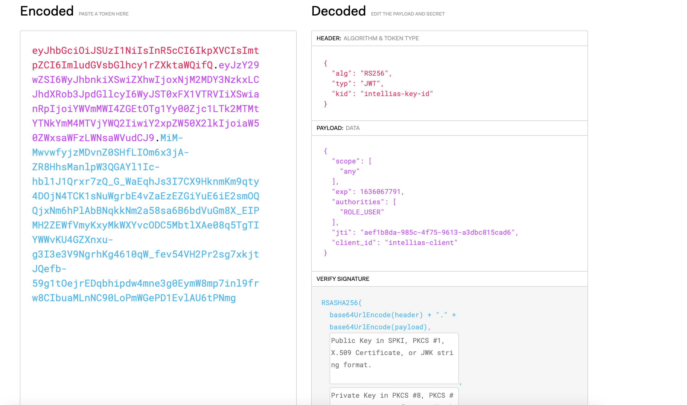

# Spring Boot OAuth2 JWT/JWKS

This project created demo purposes of JWT and JWKS with OAUTH2.

Sequence diagram:


## 1. Requirements

- Unix/Linux OS
- Makefile
- Docker and Docker Compose

## 2. Installation

- `make set-up` - for setting up a docker network
- `make up` - for building & starting ms-authorization-server and ms-resource-server
- `make send-authentication-request ` - with request user will authenticate and retrieve access token
- `make ACCESS_TOKEN={access token from previous request} send-resource-request ` - fill access token from previous 
  request and send request to protected resource server
- `make down` - for shutdown ms-authorization-server and ms-resource-server
- `make clean` - for removing the docker network

Ps: Each app also is runnable individually by `make ms-authorization-server-up` or `make ms-resource-server-down`.

## 3. Accessibility & Configuration

- **Authorization Server** will be available at `http://localhost:8081`
- **Resource Server** will be available at `http://localhost:8082`

JWKS Key Sets (with public key):
```json
{
  "keys": [
    {
      "kty": "RSA",
      "e": "AQAB",
      "use": "sig",
      "kid": "intellias-key-id",
      "alg": "RS256",
      "n": "qJM1_wcVVMr6gNUh5og4NsOx3RG3L5AHMvo2DkssN8lZ8dmrRQU1Vo1Idbpy1H-0yvXxrO4eyemhMFzqxNLK8fNKVEMHVzef53p3Kdu4P3KYx0nr7r2BVphGXHTx8ZyRJQ9hi85n7jEa5ZFScBa-eyRd4PpIjGDvPl6c0X1DWQSgZ4jsnSEOPf82E75NBQRiGvVjT4O7M3394w0xWiLnGZoo6sD7_N1uMiMR6ckkiCHUIrwmYlVeEznLzNoCpHIhtfIEBx4NjhelgP4MunK9iDKwkLvP7CaUHifzI-9N2ZN6o606tswXIxtS2Hk_kwuhegbtiEf5NUhYnTJNl7u2HQ"
    }
  ]
}
```

Sample of JWT token with custom header:




For making custom key pair for signing/verifying:
```shell
keytool -genkeypair \
  -alias intellias-oauth-jwt \
  -keyalg RSA \
  -keypass intellias-pass \
  -keystore intellias-jwt.jks \
  -storepass intellias-pass
```
With the command below RSA 1024 bit size JKS file will be created.

Note: A **JKS** file is an encrypted security file used to store a set of cryptographic keys or certificates in the binary Java KeyStore (JKS) format.

ECC RSA Comparision:


## 4. Credits

- [JWT (JSON Web Token)](https://hackernoon.com/json-web-tokens-jwt-demystified-f7e202249640)
- [JWT (Validate)](https://jwt.io)


